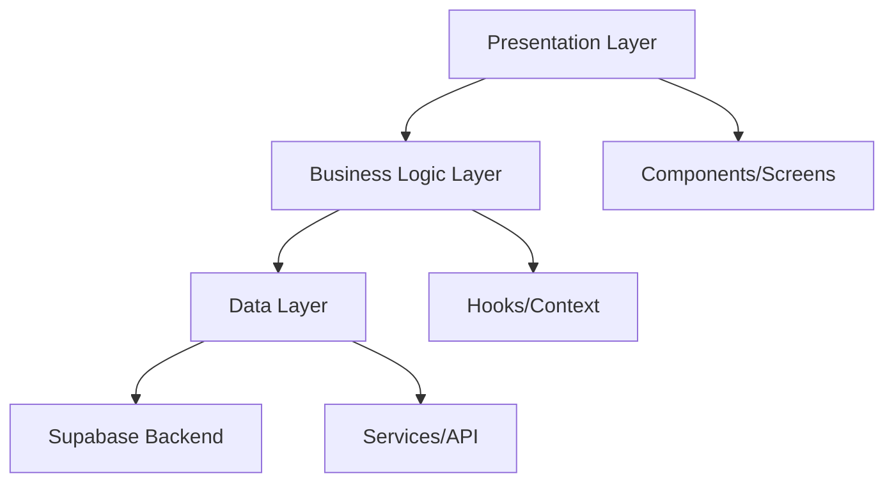
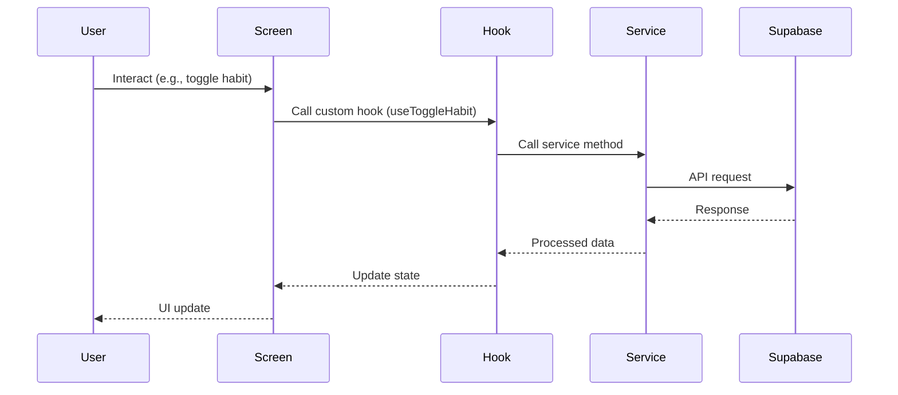

# VibeTracker - Arsitektur Aplikasi

## 📋 Ringkasan Proyek

**VibeTracker** adalah aplikasi mobile pencatat kebiasaan (habit tracker) yang membantu pengguna melacak dan mengelola kebiasaan harian mereka.

### Tech Stack
- **Framework**: React Native dengan Expo (SDK 51+)
- **Navigation**: Expo Router (File-based routing)
- **Language**: TypeScript
- **Styling**: NativeWind v4 (Tailwind CSS untuk React Native)
- **Backend & Database**: Supabase (Authentication, PostgreSQL, Real-time)
- **State Management**: React Context API + Custom Hooks

---

## 🏛️ Arsitektur Aplikasi

Aplikasi ini menggunakan **Feature-Based Architecture** dengan pemisahan concerns yang jelas:



### Prinsip Arsitektur:
1. **Separation of Concerns**: Pemisahan UI, logic, dan data layer
2. **Feature-Based Structure**: Organisasi kode berdasarkan fitur, bukan tipe file
3. **Reusability**: Komponen dan hooks yang dapat digunakan kembali
4. **Type Safety**: TypeScript strict mode untuk mencegah error
5. **Scalability**: Struktur yang mudah dikembangkan untuk fitur baru

---

## 📁 Struktur Folder

```
VibeTracker/
│
├── app/                          # Expo Router - File-based routing
│   ├── (auth)/                   # Auth group
│   │   ├── _layout.tsx          # Auth layout
│   │   ├── login.tsx            # Login screen
│   │   └── register.tsx         # Register screen
│   │
│   ├── (tabs)/                   # Main app tabs group
│   │   ├── _layout.tsx          # Tabs layout
│   │   ├── index.tsx            # Home screen (Habits list)
│   │   └── profile.tsx          # Profile screen (future)
│   │
│   ├── habits/                   # Habits feature screens
│   │   ├── add.tsx              # Add new habit screen
│   │   └── [id].tsx             # Habit detail screen (future)
│   │
│   ├── _layout.tsx               # Root layout
│   └── +not-found.tsx            # 404 screen
│
├── src/
│   ├── components/               # Reusable components
│   │   ├── ui/                  # Base UI components
│   │   │   ├── Button.tsx
│   │   │   ├── Input.tsx
│   │   │   ├── Card.tsx
│   │   │   └── Loading.tsx
│   │   │
│   │   ├── habits/              # Habit-specific components
│   │   │   ├── HabitCard.tsx
│   │   │   ├── HabitList.tsx
│   │   │   └── HabitCheckbox.tsx
│   │   │
│   │   └── layout/              # Layout components
│   │       ├── Container.tsx
│   │       └── SafeAreaView.tsx
│   │
│   ├── features/                 # Feature modules
│   │   ├── auth/
│   │   │   ├── hooks/
│   │   │   │   ├── useAuth.ts
│   │   │   │   └── useAuthForm.ts
│   │   │   ├── context/
│   │   │   │   └── AuthContext.tsx
│   │   │   └── types.ts
│   │   │
│   │   └── habits/
│   │       ├── hooks/
│   │       │   ├── useHabits.ts
│   │       │   ├── useAddHabit.ts
│   │       │   └── useToggleHabit.ts
│   │       ├── context/
│   │       │   └── HabitsContext.tsx
│   │       └── types.ts
│   │
│   ├── services/                 # External services & API
│   │   ├── supabase/
│   │   │   ├── client.ts        # Supabase client config
│   │   │   ├── auth.service.ts  # Auth operations
│   │   │   └── habits.service.ts # Habits CRUD operations
│   │   │
│   │   └── api/                 # API helpers
│   │       └── errorHandler.ts
│   │
│   ├── lib/                      # Utilities & helpers
│   │   ├── utils.ts             # General utilities
│   │   ├── validation.ts        # Form validation
│   │   └── constants.ts         # App constants
│   │
│   ├── types/                    # Global TypeScript types
│   │   ├── database.types.ts    # Supabase generated types
│   │   ├── habit.types.ts
│   │   └── user.types.ts
│   │
│   └── config/                   # App configuration
│       └── env.ts               # Environment variables
│
├── assets/                       # Static assets
│   ├── fonts/
│   ├── images/
│   └── icons/
│
├── .env.local                    # Environment variables (not committed)
├── .env.example                  # Environment variables example
├── tailwind.config.js            # NativeWind configuration
├── app.json                      # Expo configuration
├── tsconfig.json                 # TypeScript configuration
└── package.json                  # Dependencies
```

---

## 🗄️ Skema Database Supabase

### 1. Tabel: `users` (Handled by Supabase Auth)

Supabase Auth secara otomatis mengelola tabel `auth.users`. Kita akan membuat tabel profile tambahan jika diperlukan.

### 2. Tabel: `profiles` (Optional - User Extended Info)

```sql
CREATE TABLE profiles (
  id UUID REFERENCES auth.users(id) PRIMARY KEY,
  email TEXT,
  full_name TEXT,
  avatar_url TEXT,
  created_at TIMESTAMP WITH TIME ZONE DEFAULT NOW(),
  updated_at TIMESTAMP WITH TIME ZONE DEFAULT NOW()
);

-- Enable Row Level Security
ALTER TABLE profiles ENABLE ROW LEVEL SECURITY;

-- Policy: Users can only view and update their own profile
CREATE POLICY "Users can view their own profile" 
  ON profiles FOR SELECT 
  USING (auth.uid() = id);

CREATE POLICY "Users can update their own profile" 
  ON profiles FOR UPDATE 
  USING (auth.uid() = id);
```

### 3. Tabel: `habits`

Tabel utama untuk menyimpan kebiasaan pengguna.

```sql
CREATE TABLE habits (
  id UUID DEFAULT gen_random_uuid() PRIMARY KEY,
  user_id UUID REFERENCES auth.users(id) ON DELETE CASCADE NOT NULL,
  name TEXT NOT NULL,
  description TEXT,
  icon TEXT,                    -- Icon name (emoji or icon code)
  color TEXT DEFAULT '#3B82F6', -- Hex color for habit card
  frequency TEXT DEFAULT 'daily', -- 'daily', 'weekly', 'custom'
  is_active BOOLEAN DEFAULT TRUE,
  created_at TIMESTAMP WITH TIME ZONE DEFAULT NOW(),
  updated_at TIMESTAMP WITH TIME ZONE DEFAULT NOW()
);

-- Index untuk query cepat
CREATE INDEX habits_user_id_idx ON habits(user_id);
CREATE INDEX habits_is_active_idx ON habits(is_active);

-- Enable Row Level Security
ALTER TABLE habits ENABLE ROW LEVEL SECURITY;

-- Policy: Users can only CRUD their own habits
CREATE POLICY "Users can view their own habits" 
  ON habits FOR SELECT 
  USING (auth.uid() = user_id);

CREATE POLICY "Users can create their own habits" 
  ON habits FOR INSERT 
  WITH CHECK (auth.uid() = user_id);

CREATE POLICY "Users can update their own habits" 
  ON habits FOR UPDATE 
  USING (auth.uid() = user_id);

CREATE POLICY "Users can delete their own habits" 
  ON habits FOR DELETE 
  USING (auth.uid() = user_id);
```

### 4. Tabel: `habit_logs`

Tabel untuk melacak completion/check-in dari setiap habit per hari.

```sql
CREATE TABLE habit_logs (
  id UUID DEFAULT gen_random_uuid() PRIMARY KEY,
  habit_id UUID REFERENCES habits(id) ON DELETE CASCADE NOT NULL,
  user_id UUID REFERENCES auth.users(id) ON DELETE CASCADE NOT NULL,
  completed_at TIMESTAMP WITH TIME ZONE DEFAULT NOW(),
  date DATE NOT NULL DEFAULT CURRENT_DATE, -- Tanggal completion
  notes TEXT,                   -- Optional notes
  
  -- Constraint: Satu habit hanya bisa di-complete sekali per hari
  UNIQUE(habit_id, date)
);

-- Index untuk query cepat
CREATE INDEX habit_logs_habit_id_idx ON habit_logs(habit_id);
CREATE INDEX habit_logs_user_id_idx ON habit_logs(user_id);
CREATE INDEX habit_logs_date_idx ON habit_logs(date);

-- Enable Row Level Security
ALTER TABLE habit_logs ENABLE ROW LEVEL SECURITY;

-- Policy: Users can only CRUD their own logs
CREATE POLICY "Users can view their own habit logs" 
  ON habit_logs FOR SELECT 
  USING (auth.uid() = user_id);

CREATE POLICY "Users can create their own habit logs" 
  ON habit_logs FOR INSERT 
  WITH CHECK (auth.uid() = user_id);

CREATE POLICY "Users can delete their own habit logs" 
  ON habit_logs FOR DELETE 
  USING (auth.uid() = user_id);
```

### TypeScript Types (Generated from Supabase)

```typescript
// src/types/database.types.ts
export type Habit = {
  id: string;
  user_id: string;
  name: string;
  description: string | null;
  icon: string | null;
  color: string;
  frequency: 'daily' | 'weekly' | 'custom';
  is_active: boolean;
  created_at: string;
  updated_at: string;
};

export type HabitLog = {
  id: string;
  habit_id: string;
  user_id: string;
  completed_at: string;
  date: string;
  notes: string | null;
};

export type Profile = {
  id: string;
  email: string | null;
  full_name: string | null;
  avatar_url: string | null;
  created_at: string;
  updated_at: string;
};
```

---

## 🔄 Data Flow



---

## 🚀 Rencana Implementasi (Step-by-Step)

### Phase 1: Project Setup & Configuration
- [ ] Inisialisasi Expo project dengan TypeScript template
- [ ] Install dan konfigurasi dependencies (Expo Router, NativeWind, Supabase)
- [ ] Setup NativeWind v4 (tailwind.config.js, global.css)
- [ ] Konfigurasi TypeScript (tsconfig.json dengan strict mode)
- [ ] Setup environment variables (.env.local untuk Supabase keys)
- [ ] Konfigurasi Expo Router file structure (app directory)

### Phase 2: Supabase Backend Setup
- [ ] Buat Supabase project di dashboard
- [ ] Setup database schema (run SQL untuk tables: profiles, habits, habit_logs)
- [ ] Enable Row Level Security (RLS) policies untuk semua tabel
- [ ] Generate TypeScript types dari Supabase schema
- [ ] Test koneksi Supabase dari aplikasi
- [ ] Setup Supabase Auth providers (Email/Password)

### Phase 3: Core Infrastructure
- [ ] Buat Supabase client configuration (src/services/supabase/client.ts)
- [ ] Implementasi Auth service (login, register, logout, session)
- [ ] Implementasi Habits service (CRUD operations)
- [ ] Buat AuthContext & AuthProvider untuk global auth state
- [ ] Buat custom hook useAuth untuk akses auth state
- [ ] Setup protected routes dengan Expo Router

### Phase 4: UI Components Library
- [ ] Buat base UI components (Button, Input, Card)
- [ ] Implementasi Loading dan Error states
- [ ] Buat layout components (Container, SafeAreaView)
- [ ] Style components dengan NativeWind (Tailwind classes)
- [ ] Buat Storybook/preview untuk testing components (optional)

### Phase 5: Authentication Feature
- [ ] Implementasi Login screen UI (app/(auth)/login.tsx)
- [ ] Implementasi Register screen UI (app/(auth)/register.tsx)
- [ ] Buat form validation untuk auth forms
- [ ] Integrasikan Supabase Auth dengan login/register screens
- [ ] Handle error states (invalid credentials, network errors)
- [ ] Implementasi auto-login dengan stored session
- [ ] Test authentication flow lengkap

### Phase 6: Home Screen (Habits List)
- [ ] Buat Home screen layout (app/(tabs)/index.tsx)
- [ ] Implementasi useHabits hook untuk fetch habits
- [ ] Buat HabitCard component untuk display single habit
- [ ] Buat HabitList component untuk display all habits
- [ ] Implementasi HabitCheckbox untuk toggle completion
- [ ] Integrasikan real-time updates (Supabase subscriptions)
- [ ] Implementasi empty state (when no habits)
- [ ] Implementasi loading state saat fetch data

### Phase 7: Add Habit Feature
- [ ] Buat Add Habit screen UI (app/habits/add.tsx)
- [ ] Buat form dengan fields (name, description, icon, color)
- [ ] Implementasi form validation
- [ ] Buat useAddHabit hook untuk create habit
- [ ] Integrasikan dengan Supabase habits service
- [ ] Handle success/error states
- [ ] Navigate back ke Home setelah berhasil add habit
- [ ] Test add habit flow lengkap

### Phase 8: Habit Completion Logic
- [ ] Implementasi useToggleHabit hook
- [ ] Buat logic untuk check/uncheck habit (insert/delete habit_logs)
- [ ] Update UI real-time setelah toggle
- [ ] Handle edge cases (already completed today, network error)
- [ ] Implementasi optimistic UI updates
- [ ] Test toggle completion flow

### Phase 9: Testing & Bug Fixes
- [ ] Test authentication flow di device (Android/iOS)
- [ ] Test habits CRUD operations
- [ ] Test habit completion toggle
- [ ] Fix bugs dan edge cases
- [ ] Test offline behavior (error handling)
- [ ] Validate RLS policies di Supabase

### Phase 10: Polish & Optimization
- [ ] Improve UI/UX (animations, transitions)
- [ ] Optimize performance (memoization, lazy loading)
- [ ] Add haptic feedback untuk interactions
- [ ] Implement proper error boundaries
- [ ] Add loading skeletons untuk better UX
- [ ] Final testing di multiple devices

### Phase 11: Documentation & Deployment
- [ ] Write README.md dengan setup instructions
- [ ] Document API services dan hooks
- [ ] Setup EAS Build untuk production builds
- [ ] Build APK untuk testing
- [ ] Prepare untuk deployment ke stores (future)

---

## 🎯 MVP Features Priority

### Must Have (Core MVP):
1. ✅ User Authentication (Login/Register)
2. ✅ View habits list untuk hari ini
3. ✅ Add new habit
4. ✅ Toggle habit completion (check/uncheck)

### Nice to Have (Post-MVP):
- Habit detail screen dengan statistics
- Edit/delete habit
- Habit streaks & progress tracking
- Calendar view untuk habit history
- Notifications/reminders
- Dark mode
- Profile customization

---

## 🔐 Security Considerations

1. **Row Level Security (RLS)**: Semua tabel menggunakan RLS untuk memastikan users hanya bisa akses data mereka sendiri
2. **Environment Variables**: Supabase keys disimpan di `.env.local` dan tidak di-commit ke Git
3. **Type Safety**: TypeScript strict mode untuk mencegah runtime errors
4. **Input Validation**: Semua user inputs divalidasi sebelum dikirim ke backend
5. **Error Handling**: Proper error handling untuk mencegah exposure sensitive info

---

## 📦 Dependencies (Estimasi)

```json
{
  "dependencies": {
    "expo": "^51.0.0",
    "expo-router": "^3.5.0",
    "react": "^18.2.0",
    "react-native": "^0.74.0",
    "@supabase/supabase-js": "^2.43.0",
    "nativewind": "^4.0.0",
    "expo-secure-store": "^13.0.0"
  },
  "devDependencies": {
    "@types/react": "^18.2.0",
    "typescript": "^5.3.0",
    "tailwindcss": "^3.4.0"
  }
}
```

---

## 🎨 Design System

### Color Palette (NativeWind/Tailwind):
- **Primary**: Blue 600 (`#3B82F6`)
- **Success**: Green 600 (`#10B981`)
- **Error**: Red 600 (`#EF4444`)
- **Background**: White / Gray 50
- **Text**: Gray 900 / Gray 600

### Typography:
- **Headings**: Font size 24-32 (Tailwind: text-2xl, text-3xl)
- **Body**: Font size 16 (Tailwind: text-base)
- **Small**: Font size 14 (Tailwind: text-sm)

### Spacing:
- Menggunakan Tailwind spacing scale (4, 8, 16, 24, 32px)

---

## 📱 Navigation Structure

```
App
├── (auth) - Auth Flow
│   ├── login
│   └── register
│
└── (tabs) - Main App (Protected)
    ├── index (Home - Habits List)
    ├── habits
    │   └── add (Add Habit)
    └── profile (Future)
```

---

## 🔧 Environment Variables

File: `.env.local`

```env
EXPO_PUBLIC_SUPABASE_URL=https://your-project.supabase.co
EXPO_PUBLIC_SUPABASE_ANON_KEY=your-anon-key
```

---

## 📚 Resources & References

- [Expo Documentation](https://docs.expo.dev)
- [Expo Router Documentation](https://docs.expo.dev/router/introduction/)
- [NativeWind v4 Documentation](https://www.nativewind.dev)
- [Supabase Documentation](https://supabase.com/docs)
- [Supabase Auth Guide](https://supabase.com/docs/guides/auth)
- [React Native TypeScript](https://reactnative.dev/docs/typescript)

---

## 🚦 Next Steps

Setelah review dan approval arsitektur ini:

1. **Switch ke Code Mode** untuk mulai implementasi
2. Mulai dari Phase 1 (Project Setup)
3. Follow step-by-step implementation checklist
4. Test setiap phase sebelum lanjut ke phase berikutnya

---

**Catatan**: Dokumen ini adalah living document dan akan di-update seiring development progress.
